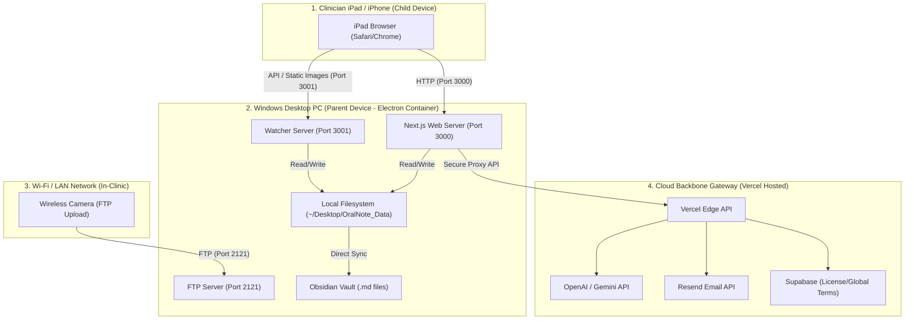
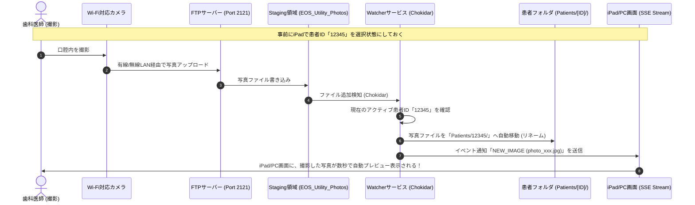
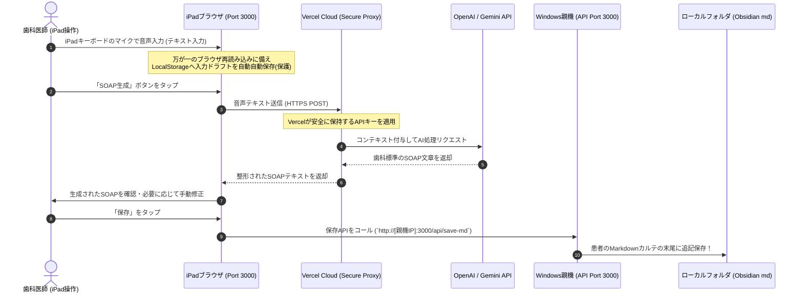

# OralNote - システム構成・仕様書 (System Specifications)

本書は、歯科臨床用カルテ生成・画像管理支援システム **「OralNote (オラルノート)」** の全容、ハイブリッドアーキテクチャ、データフロー、およびネットワーク仕様をまとめた定義書です。
今後の機能拡張、AIによる開発支援、および他システムとの連携時にシステム構成を即座に把握するためのリファレンスとして使用します。

---

## 1. システム概要 & 設計思想

OralNoteは、**「究極のデータセキュリティ（院内完結）」**と**「iPadによるスマートな操作性」**を両立する、**ローカル親機・子機ハイブリッド型 デスクトップアプリケーション（Dental OS）** です。

### 3大コアバリュー
1. **完全院内完結型セキュリティ (Offline-First Local Storage)**
   * 患者のカルテ文章や口腔内写真は、クラウドデータベースには一切保存されません。すべて院内のWindows PCのローカルハードディスク（およびObsidianフォルダ）に保存されます。これにより情報漏洩リスクを完全に排除します。
2. **インストール不要のマルチデバイス連携 (Zero-Installation Client)**
   * 親機であるWindows PCでシステムを起動すると、自動的にローカルサーバーが立ち上がります。子機であるiPadやスマートフォンは、画面に表示されるQRコードをスキャンするだけで、アプリをインストールすることなくブラウザ経由でリモコン（操作子機）として機能します。
3. **AIを活用した高速カルテ（SOAP）作成**
   * iPadのマイクを使用したネイティブ音声入力と、クラウドAI（OpenAI/Gemini）をセキュアに連携させ、日常会話レベルの歯科用音声入力から、綺麗に整形された歯科標準のSOAPカルテ文章を瞬時に自動生成します。

---

## 2. システムアーキテクチャ (全体構造)

システムは **① Windowsデスクトップコンテナ (Electron)**、**② 院内ローカルネットワーク (LAN)**、**③ クラウドゲートウェイ (Vercel & APIs)** の3つのレイヤーで構成されています。



### 動作ポート & プロトコル一覧
| コンポーネント | ポート番号 | プロトコル | 役割・用途 |
| :--- | :--- | :--- | :--- |
| **Next.js Web Server** | `3000` | HTTP | UI画面の提供（PC親機画面およびiPadブラウザ画面） |
| **Watcher Express API** | `3001` | HTTP / SSE | 画像の配信、アクティブ患者IDの制御、新着画像通知ストリーム |
| **Local FTP Server** | `2121` | FTP | ワイヤレスカメラ（キヤノン・ニコン等）からの写真自動受信 |

---

## 3. ディレクトリ構成 & データストレージ仕様

### A. データ保存場所 (Local Storage Layout)
すべての患者データおよび画像は、Windows PCのデスクトップ上の指定ディレクトリに保存されます。

```text
Desktop/
├── EOS_Utility_Photos/            # カメラから一時的に写真がアップロードされる一時領域 (Staging)
└── OralNote_Data/
    ├── Patients/                  # 患者データベース
    │   ├── [患者ID_名前]/
    │   │   ├── [患者ID_名前].md   # SOAPカルテ履歴ファイル（Obsidian対応）
    │   │   ├── photo_001.jpg      # 口腔内写真 (圧縮済)
    │   │   └── photo_002.jpg
    │   └── [患者ID_名前_2]/
    └── Unassigned/                # 患者を選択せずに撮影した写真が一時保存されるフォルダ
```

### B. カルテファイル仕様 (Obsidian互換Markdown)
カルテは標準的な Markdown (`.md`) 形式で保存され、ナレッジ管理ツール「Obsidian」で直接開いて管理・検索することが可能です。

**ファイルの記述例:**
```markdown
# [患者ID/名前] カルテ履歴

## 2026-05-21 20:00 [担当: 松島]
**[S] (主訴・主観的所見):**
右下奥歯がしみる、痛みがある。

**[O] (客観的所見):**
#47 遠心隣接面にC2のう蝕を確認。冷水痛あり、打診痛(-)。

**[A] (評価・診断):**
#47 象牙質う蝕（隣接面）

**[P] (治療計画・処置):**
麻酔下にて軟化象牙質除去。
CR充填にて即日修復完了。経過観察。
---
```

---

## 4. 主要ワークフロー (コア機能シーケンス)

### ① ワイヤレスカメラ画像自動振り分けフロー
カメラで撮影した写真が、PCを一切操作することなく自動で適切な患者フォルダに格納されるフローです。



### ② 音声入力 & AI SOAP生成フロー
iPadのマイクから吹き込んだ音声テキストを、安全にAIで変換し親機へ保存するフローです。



---

## 5. 環境自動判定 & セキュリティ防御仕様

OralNoteは、**Webホスト（Vercel）用** と **院内ローカル用** で同一のコードベースを使用しています。セキュリティを担保するため、ブラウザ実行時にアクセス元のホスト名を自動検知し、挙動をダイナミックに切り替えます。

### 判定アルゴリズム (isPublicWeb Check)
```typescript
const hostname = window.location.hostname;
const isLocal = hostname === 'localhost' || 
                hostname === '127.0.0.1' || 
                hostname.endsWith('.local') ||
                /^(192\.168\.|10\.|172\.)/.test(hostname);

const isPublicWeb = !isLocal;
```

### 判定結果による挙動の切り替え
#### A. クラウドWeb上でのアクセス (`isPublicWeb === true` - 例: `oralnote.vercel.app`)
*   **挙動：** **「Web版サービス統合・移行のご案内」フルスクリーンを強制表示**します。
*   **詳細：** ログインやデータベース操作、カルテの閲覧機能を完全にシャットアウトし、利用者に「Windowsデスクトップ版（v1.2.0）インストーラー」のダウンロードを促します。
*   **マーケティングルート：** ただし、紹介用LP (`/lp`) および法的表示 (`/tokushoho`) に直接アクセスした場合は、通常通り美しいウェブページが表示されます。

#### B. 院内ローカル環境でのアクセス (`isPublicWeb === false` - 例: `localhost:3000` または `192.168.1.50:3000`)
*   **挙動：** **フルスペックの「OralNote」カルテシステムが稼働**します。
*   **詳細：** 親機Windowsコンテナ、および同一Wi-FiルーターからQRコード経由でアクセスしたiPad子機に対して、すべてのローカル操作、ファイル保存、AI生成、技工指示書作成機能をアクティブにします。

---

## 6. 付加機能仕様

### A. 技工指示書メール送信機能 (Technician Order) [v1.2.0 アップデート]
*   **概要：** 登録・編集可能な技工所宛てに、シェード写真や指示書写真を添付して直接メール送信。
*   **複数画像（最大4枚）対応：** 1枚のみだったシェード写真を、最大4枚まで同時に選択・プレビュー・個別削除ができるグリッドUIへ強化。
*   **レイアウト変更（ご要望準拠）：** 画像添付エリア（STEP 3）の並び順をスワップ。左側に「手書き指示書の写真」、右側に最大4枚の「シェード写真（グリッド）」を配置し、視認性と操作性を劇的に向上。
*   **5枚以上の大量写真対応：** 5枚以上の大量の写真を送信する場合は、メール添付制限による送信エラーを防ぐため、「Google Drive等の共有リンクをSTEP 2の指示内容詳細欄に貼り付ける」よう促す解説 callout（💡ティップス）をSTEP 2およびSTEP 3へ追加。
*   **画像圧縮機能：** アップロード時のエラーやメールサーバー容量オーバーを防ぐため、送信前にフロントエンド（ブラウザ上）で画像を最大幅1600px、画質80%の**JPEGへ自動超高速圧縮**します（複数枚対応）。
*   **二重送信防止：** 送信ボタン押下時に即座にUIを「送信中」としてボタンを無効化。
*   **CC・返信仕様：** 送信時にクリニックのメールアドレスを自動的に **BCC** に入れ、返信先 (**Reply-To**) をクリニックに設定することで、技工所が返信したメールが直接クリニックに届く設計。

### B. 治療説明スライドジェネレーター (Slide Generator)
*   **概要：** 患者フォルダに蓄積された口腔内写真を選択し、ワンクリックで患者説明用の美しい PowerPoint (`.pptx`) または `PDF` スライドを自動生成します。

---

## 7. 将来の拡張・スケーラビリティ仕様 (臨床LANエコシステム)

将来的な「院内LAN総合データ管理システム」の構築に向け、以下の拡張ポートと設計思想が事前に考慮されています。

### 1. サブPCの「リアルタイムサブディスプレイ化」 (Multi-Screen View)
*   現在、iPadに接続情報を提供している親機のローカルサーバーは、同じLANにいる他のサブPC（デスクトップ）からもブラウザでアクセス可能です。
*   子機PCから `http://[親機IP]:3000/viewer` 等にアクセスすることで、**「操作は手元のiPad」「自動で口腔内写真が目の前のサブPCの大画面に同期表示される」**という、マルチスクリーン診療が構築可能です。

### 2. 子機PCからの「カメラ写真の自動親機転送」
*   有線LANで接続された診察ブースの子機PCに置かれたカメラ転送ソフトと、親機のWatcher（Port 3001）を連携させることで、診察室のどこで撮影された写真であっても、自動的に親機PCのObsidianデータベースへ一元集約・バックアップするローカル同期機構の組み込みが容易です。

---

## 8. トラブルシューティング & ネットワーク要件

### iPadが繋がらない場合の3つの確認事項
1. **同一Wi-Fiへの接続：** Windows PCとiPadが、完全に同じWi-Fiルーター（SSID）に繋がっているか。
2. **ルーターのAP隔離設定：** Wi-Fiルーターの「プライバシーセパレーター」または「AP分離」機能がオンになっていないか（オンになっているとLAN内の相互通信が遮断されます）。
3. **Windowsファイアウォール：** Windows Defender等のファイアウォールで、Node.js / Electron の外部接続（ポート3000/3001）が許可されているか。

---

## 9. ビルド・デプロイ & クリーンアップ仕様 [v1.2.0 整備]

開発環境（Mac）から本番ターゲット（Windows）へ安全かつスムーズに最新バージョンを配置・テストできるようにするため、以下の構成が組み込まれています。

### A. 配布専用パッケージ (`OralNote_Windows_v1.2.0`)
メインの Windows PC に必要なデータのみをまとめ、無駄なファイルを省いた専用フォルダです。
*   **構成内容:**
    1.  `OralNote Setup 1.2.0.exe`：最新の Windows 用デスクトップアプリインストーラー。
    2.  `cleanup-oralnote.bat`：Windows 上の競合プロセスをキルし、古いキャッシュを掃除するワンクリックツール。
    3.  `scripts/cleanup-oralnote.ps1`：掃除処理の本体シェルスクリプト。

### B. クリーンアップ仕様（データ・プロセスの掃除）
Electron 開発において、古いデータベーススキーマや状態管理キャッシュが残っていると不具合を起こすことがあるため、完全にリフレッシュするための機能が Mac・Windows 双方にあります。
1.  **Windows用 (`cleanup-oralnote.bat` & `scripts/cleanup-oralnote.ps1`)**
    *   `OralNote`, `node` などの競合バックグラウンドプロセスを強制終了。
    *   Electron キャッシュおよび AppData (`%APPDATA%\OralNote`, `%LOCALAPPDATA%\Programs\OralNote`) などの不要な残骸データを完全に削除。
    *   デスクトップ上のカルテ・画像の実データ（`OralNote_Data`）は絶対に削除しない保護処理を実装。
2.  **Mac用 (`cleanup-oralnote.sh`)**
    *   同一 LAN に接続された iPad 子機のリモート接続用に稼働する Node サーバーや、ポート `3000`/`3001` を占有する旧サーバープロセスをキル。
    *   `~/Library/Application Support/OralNote` を含む Mac 側のアプリキャッシュ・残骸を完全削除し、常にクリーンな検証・デプロイ環境を維持。

### C. macOS上での Windows アアプリケーションビルド
*   **ビルドコマンド:** `npm run build:win`
*   **コード署名バイパス (ローカル特有):**
    *   Apple 開発者署名がないローカルビルド環境における codesign 署名エラー（`resource fork, Finder information, or similar detritus not allowed`）を防止するため、`package.json` の `"mac"` ブロックへ `"identity": null` を指定し、安全に署名ステップをバイパスするように設定。
    *   拡張属性の自動クリーンアップ用として `xattr -cr src public electron scripts package.json` などを適宜適用し、環境不具合をゼロ化。

---
*仕様策定・保守担当: Antigravity IDE*
